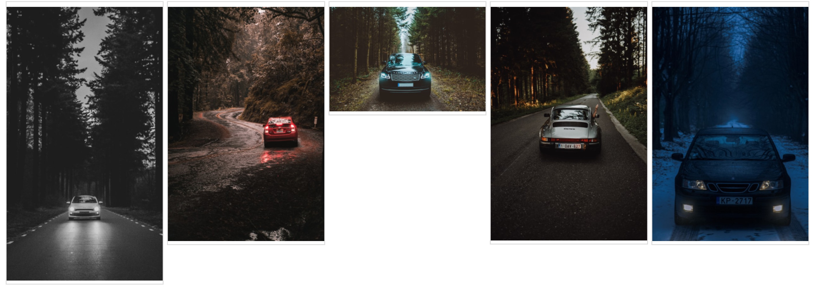

# Unsplash Image Search

Search photos on Unsplash using natural language descriptions powered by OpenAI's [CLIP model](https://github.com/openai/CLIP).

## Getting Started

Follow the steps below to setup your environment and run the example search.

1. Install the dependencies from the `requirements.txt`

```
pip install -r requirements.txt
```

2. Run the `setup-clip.ipynb` notebook to setup CLIP.

3. Run the `search-image.ipynb` to do an example search. Read the instructions in the notebook to run other experiments.

## Examples

### A car driving in the woods

-   Search keywords: `car`
-   Search results: `100`

### Search results for the keywords


### Best matches with CLIP


