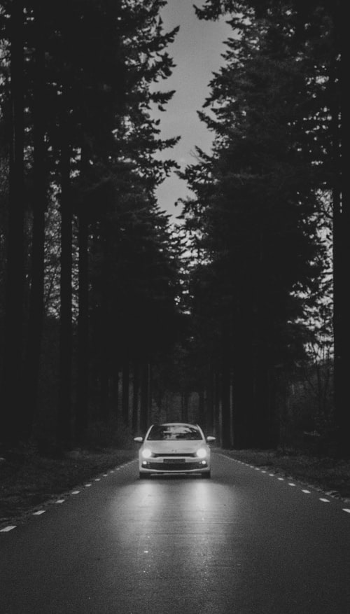
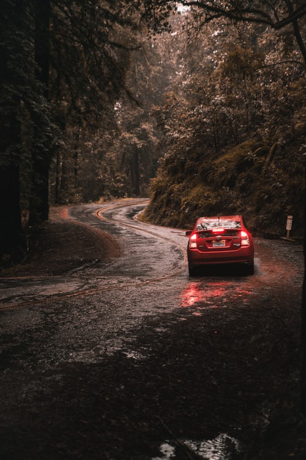
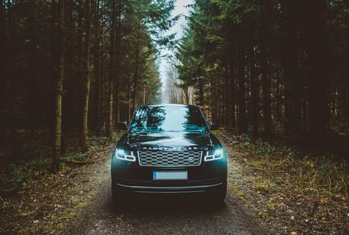

# Unsplash Image Search

Search photos on Unsplash using natural language descriptions powered by OpenAI's [CLIP model](https://github.com/openai/CLIP).

## Getting Started

Follow the steps below to setup your environment and run the example search.

1. Install the dependencies from the `requirements.txt`

```
pip install -r requirements.txt
```

2. Run the `setup-clip.ipynb` notebook to setup CLIP.

3. Run the `search-image.ipynb` to do an example search. Read the instructions in the notebook to run other experiments.

## Examples

### A car driving in the woods

We want to find photos on Unsplash that are described by the phrase **a car driving in the woods**.

First, we fetch 100 images for the keyword `car` from the Unsplash API. They contain all kinds of photos of cars.


Then, we use CLIP to find the photos that best match the phrase.



Photo by [Jorgen Hendriksen](https://unsplash.com/@jor9en?utm_source=ml_image_search&utm_medium=referral) on [Unsplash](https://unsplash.com/?utm_source=ml_image_search&utm_medium=referral)



Photo by [Matthew Ronder-Seid](https://unsplash.com/@matthewronderseid?utm_source=ml_image_search&utm_medium=referral) on [Unsplash](https://unsplash.com/?utm_source=ml_image_search&utm_medium=referral)



Photo by [Michael Heuser](https://unsplash.com/@gum_meee?utm_source=ml_image_search&utm_medium=referral) on [Unsplash](https://unsplash.com/?utm_source=ml_image_search&utm_medium=referral)

## How It Works

[CLIP](https://openai.com/blog/clip/) is a new neural network model from OpenAI trained on huge ammount of images and text descriptions. The network can be used to transform both images and text in the same latent space. This means that we can then evaluate the similarities of images with text!

## Acknowledgement

This project was inspired by these two other projects:

-   [Beyond tags and entering the semantic search era on images with OpenAI CLIP](https://towardsdatascience.com/beyond-tags-and-entering-the-semantic-search-era-on-images-with-openai-clip-1f7d629a9978) by [Ramsri Goutham Golla](https://twitter.com/ramsri_goutham)
-   [Alph, The Sacred River](https://github.com/thoppe/alph-the-sacred-river) by [Travis Hoppe](https://twitter.com/metasemantic)
