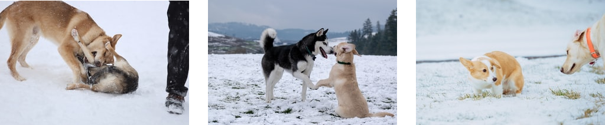
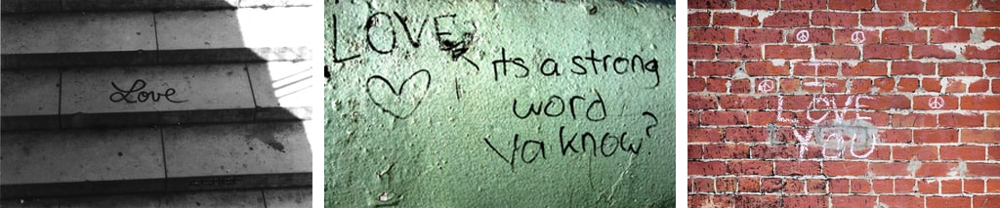
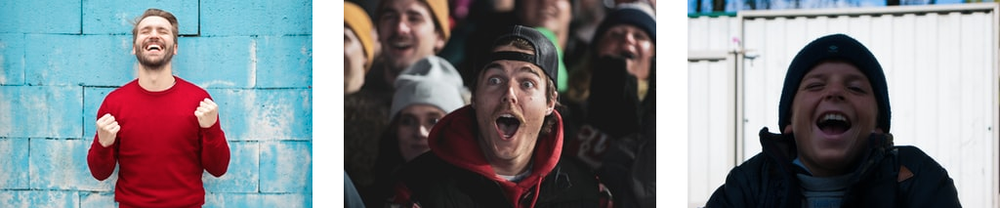

# Unsplash Image Search

[](https://colab.research.google.com/github/haltakov/natural-language-image-search/blob/main/colab/unsplash-image-search.ipynb)

Search photos on Unsplash using natural language descriptions. The search is powered by OpenAI's [CLIP model](https://github.com/openai/CLIP) and the [Unsplash Dataset](https://unsplash.com/data).

### "Two dogs playing in the snow"


<sub>Photos by [Richard Burlton](https://unsplash.com/@richardworks?utm_source=NaturalLanguageImageSearch&utm_medium=referral), [Karl Anderson](https://unsplash.com/@karlkiwi90?utm_source=NaturalLanguageImageSearch&utm_medium=referral) and [Xuecheng Chen](https://unsplash.com/@samaritan_?utm_source=NaturalLanguageImageSearch&utm_medium=referral) on [Unsplash](https://unsplash.com/?utm_source=NaturalLanguageImageSearch&utm_medium=referral).</sub>

### "The word love written on the wall"


<sub>Photos by [Genton Damian](https://unsplash.com/@damiangenton96?utm_source=NaturalLanguageImageSearch&utm_medium=referral) , [Anna Rozwadowska](https://unsplash.com/@arozwadowska?utm_source=NaturalLanguageImageSearch&utm_medium=referral), [Jude Beck](https://unsplash.com/@judebeck?utm_source=NaturalLanguageImageSearch&utm_medium=referral) on [Unsplash](https://unsplash.com/?utm_source=NaturalLanguageImageSearch&utm_medium=referral).</sub>

### "The feeling when your program finally works"


<sub>Photos by [bruce mars](https://unsplash.com/@brucemars?utm_source=NaturalLanguageImageSearch&utm_medium=referral), [LOGAN WEAVER](https://unsplash.com/@lgnwvr?utm_source=NaturalLanguageImageSearch&utm_medium=referral), [Vasyl Skunziak](https://unsplash.com/@vskvsk1?utm_source=NaturalLanguageImageSearch&utm_medium=referral) on [Unsplash](https://unsplash.com/?utm_source=NaturalLanguageImageSearch&utm_medium=referral).</sub>

### "The Syndey Opera House and the Harbour Bridge at night"


<sub>Photos by [Dalal Nizam](https://unsplash.com/@dilson?utm_source=NaturalLanguageImageSearch&utm_medium=referral) and [Anna Tremewan](https://unsplash.com/@annatre?utm_source=NaturalLanguageImageSearch&utm_medium=referral) on [Unsplash](https://unsplash.com/?utm_source=NaturalLanguageImageSearch&utm_medium=referral).</sub>

## How It Works?

OpenAI's [CLIP](https://openai.com/blog/clip/) neural network is able to transform both images and text into the same latent space, where they can be compared using a similarity measure.

For this project, all photos from the full [Unsplash Dataset](https://unsplash.com/data) (almost 2M photos) were downloaded and processed with CLIP.

The pre-computed feature vectors for all images can then be used to find the best match to a natural language search query.

## How To Run The Code?

### On Google Colab

If you just want to play around with different queries jump to the [Colab notebook](https://colab.research.google.com/github/haltakov/natural-language-image-search/blob/main/colab/unsplash-image-search.ipynb).

[](https://colab.research.google.com/github/haltakov/natural-language-image-search/blob/main/colab/unsplash-image-search.ipynb)

### On your machine

Before running any of the code, make sure to install all dependencies:

```
pip install -r requirements.txt
```

If you want to run all the code yourself open the Jupyter notebooks in the order they are numbered and follow the instructions there:

- `01-setup-clip.ipynb` - setup the environment checking out and preparing the CLIP code.
- `02-download-unsplash-dataset.ipynb` - download the photos from the Unsplash dataset
- `03-process-unsplash-dataset.ipynb` - process all photos from the dataset with CLIP
- `04-search-image-dataset.ipynb` - search for a photo in the dataset using natural language queries
- `09-search-image-api.ipynb` - search for a photo using the Unsplash Search API and filter the results using CLIP.

> NOTE: only the Lite version of the Unsplash Dataset is publicly available. If you want to use the Full version, you will need to [apply](https://unsplash.com/data) for (free) access.

> NOTE: searching for images using the Unsplash Search API doesn't require access to the Unsplash Dataset, but will probably deliver worse results.

## Acknowledgements

This project was inspired by these projects:

- [Beyond tags and entering the semantic search era on images with OpenAI CLIP](https://towardsdatascience.com/beyond-tags-and-entering-the-semantic-search-era-on-images-with-openai-clip-1f7d629a9978) by [Ramsri Goutham Golla](https://twitter.com/ramsri_goutham)
- [Alph, The Sacred River](https://github.com/thoppe/alph-the-sacred-river) by [Travis Hoppe](https://twitter.com/metasemantic)
- [OpenAI's CLIP](https://github.com/openai/CLIP)
- [Unsplash](https://unsplash.com/)
